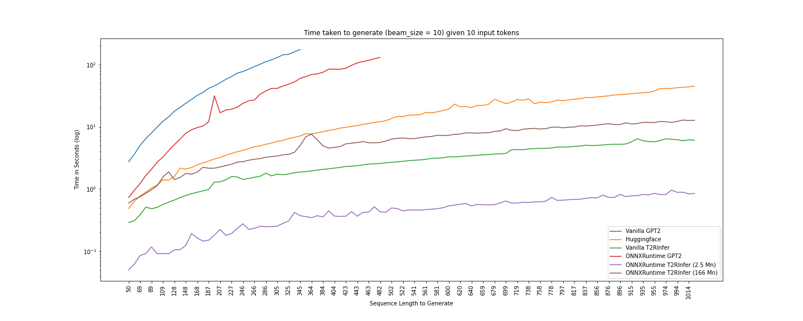
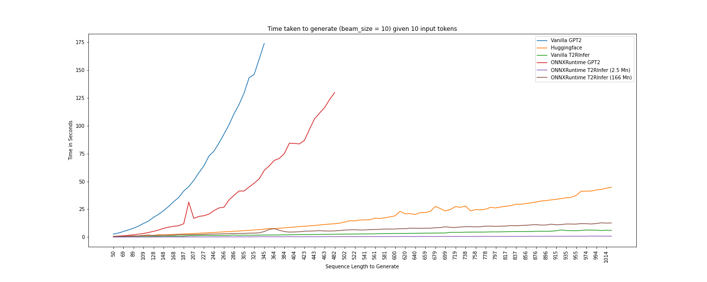

# RNN-sim

Running large number of simulations before making a decision is the best approach to solving problems and hoes hand in had with MCTS style tree search algorithms. In this repo we explore methods that can be used in this direction.

All notebooks are available in `notebooks/` folder.

* First paper we are implementing is "Finetuning Pretrained Transformers into RNNs" [[arxiv](https://arxiv.org/pdf/2103.13076.pdf)]

These are the results from above paper

With ONNX Runtime you can generate 1024 tokens in just 0.8504s (2.5Mn Params), **Insane**! You can find all the data in `notebooks/times.json`. Infact 166 Mn parameter network generates 1024 tokens almost 3.5x faster than `model.generate(1024)` for 2.5 Mn params.

# License

GNU GENERAL PUBLIC LICENSE v3
